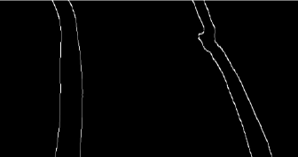
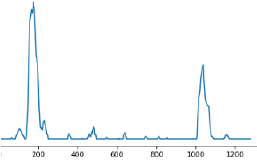
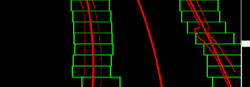

LaneDetectionRPI
================

Lane detection using regression.  
At first bird-eye view is obtained and then histogram is calculated.  
After calculating the histogram a moving average sliding window is used to
calculate the good points  
The points are used for regression to find a polynomial.

Steps followed:

Gaussian Blur: In, a Gaussian blur image processing (also known as Gaussian
smoothing) is the result of blurring an image by a (named after Gaussian
function mathematician and scientist). The visual effect image noise of this
blurring technique is a smooth blur resembling that of viewing the through a
translucent screen. Gaussian Blur is used to make the edges smoother.

Gray scaling: The images should be converted into gray scaled ones in order to
detect shapes (edges) in the images. This is because the canny edge detection
measures the magnitude of pixel intensity changes or gradients (more on this
later).

Canny edge detection: Canny edge detection which make use of the fact that edges
has high gradients (how sharply image changes — for example, dark to white)

Region of interest: When finding lane lines, we are not interested in other
environmental disturbances .So we mask the other regions as per our requirement.

Perspective transform: We now need to define a trapezoidal region in the 2D
image that will go through a perspective transform to convert into a bird’s eye
view. It’s the change in the perspective when we see the image from side and
when we see it as top-down view.

The curve lines looks almost straight after the transform as can be seen in the
below image.

Histogram: We then compute a histogram of our binary thresholded images in the y
direction, on the bottom half of the image, to identify the x positions where
the pixel intensities are highest.

Here the frame is divided into two parts, left and right sides and that is how
we get the exact indices of the frame. The operation is done on both sides to
detect the lane on both the sides.

As it can be seen in the below image the histogram is quite high at the position
where lane is detected.

Sliding window: Since we now know the starting x position of pixels (from the
bottom of the image) most likely to yield a lane line, we run a sliding windows
search in an attempt to “capture” the pixel coordinates of our lane lines.

Next, we compute a second degree polynomial, via numpy’s polyfit, to find the
coefficients of the curves that best fit the left and right lane lines.

The detected lane can be seen below:

